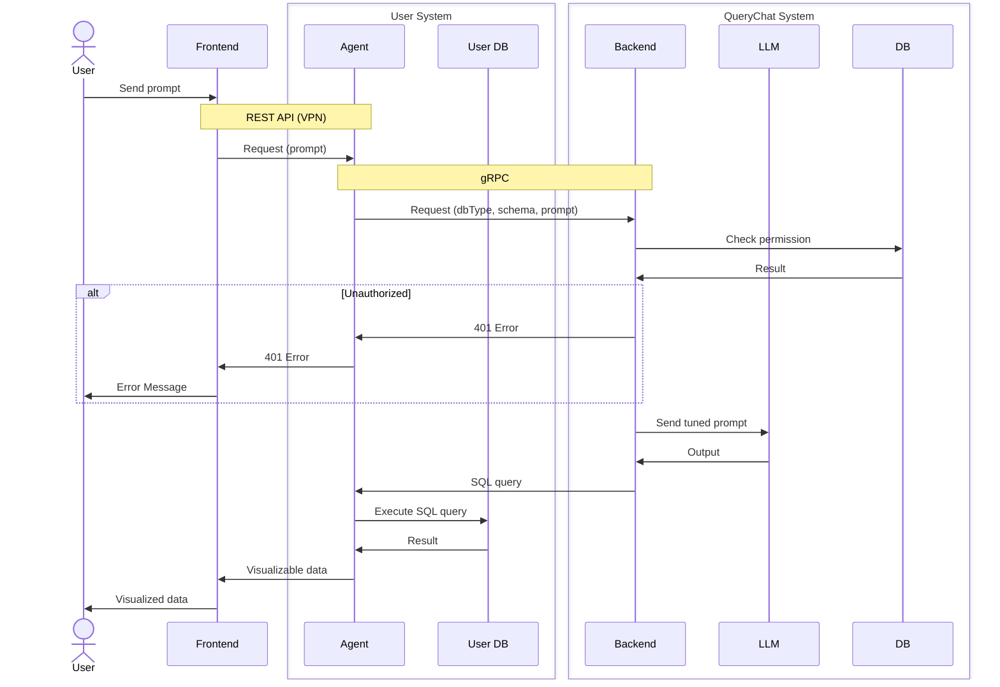

# QueryChat

## Sequence Diagram



## Technologies

### Frontend

- TypeScript
- Bun
- Next.js
- shadcn/ui
- Recharts

### Agent

- Go
- ogen
- REST API
- OpenAPI
- gRPC
- Docker

### Backend

- Go
- ogen
- gRPC
- dockertest
- sqlc
- Docker
- redis

### LLM

- Python
- gRPC
- OpenAI

### Database

- MySQL

### DevOps

- GitHub Actions
- ArgoCD

### Infrastructure

- Proxmox
- Ubuntu
- Terraform
- Ansible
- Kubernetes
- Prometheus
- Grafana
- Loki
- Fluent Bit
- cert-manager
- Let's Encrypt

## Development Flow

Trunk-based development. Every commit is a release candidate.

Treat commit messages as Pull Request equivalents. Commit message format is as follows:

```plaintext
<type>(<issue title & id>): <description>

<body>
```

- Commit titles should begin with a lowercase letter
- Should add issue id to link the commit to the issue

For example:

```plaintext
fix(a display bug #20045): fix a display bug in the user list

The user list is not displayed correctly when the user has a long name...
```
