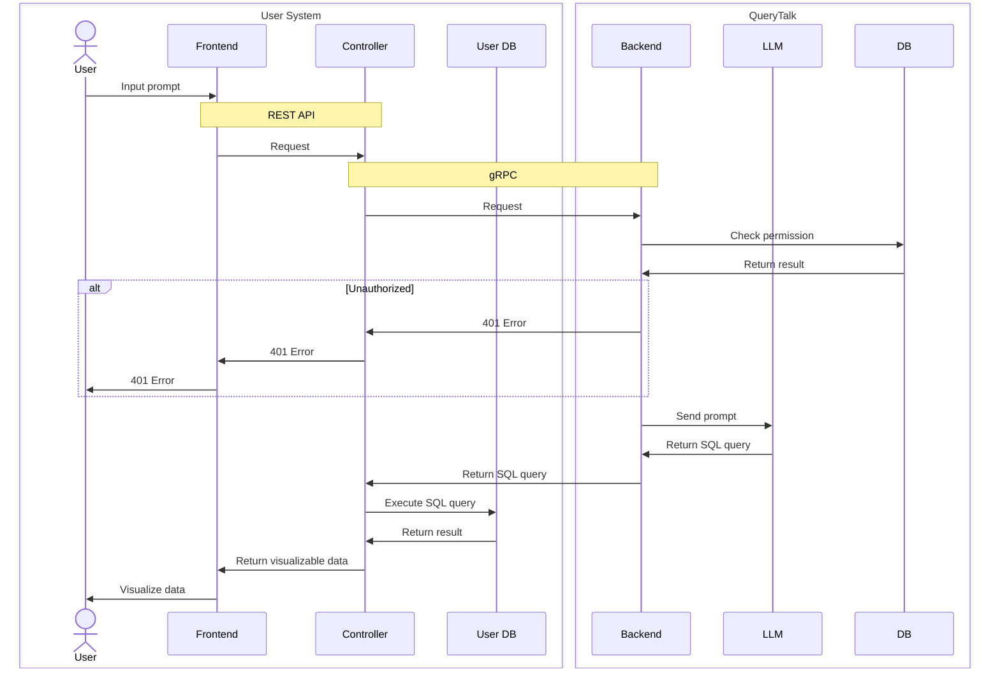

# Specification

## Sequence Diagram

## Technologies

### Frontend

- TypeScript
- Next.js
- shadcn/ui

### Backend

- Go
- ogen
- REST API
- OpenAPI
- gRPC
- dockertest
- sqlc
- MySQL
- Docker
- redis

### DevOps

- GitHub Actions
- ArgoCD

### Infrastructure

- Proxmox
- Ubuntu
- Terraform
- Ansible
- Kubernetes
- Prometheus
- Grafana
- Loki
- Fluent Bit
- cert-manager
- Let's Encrypt
